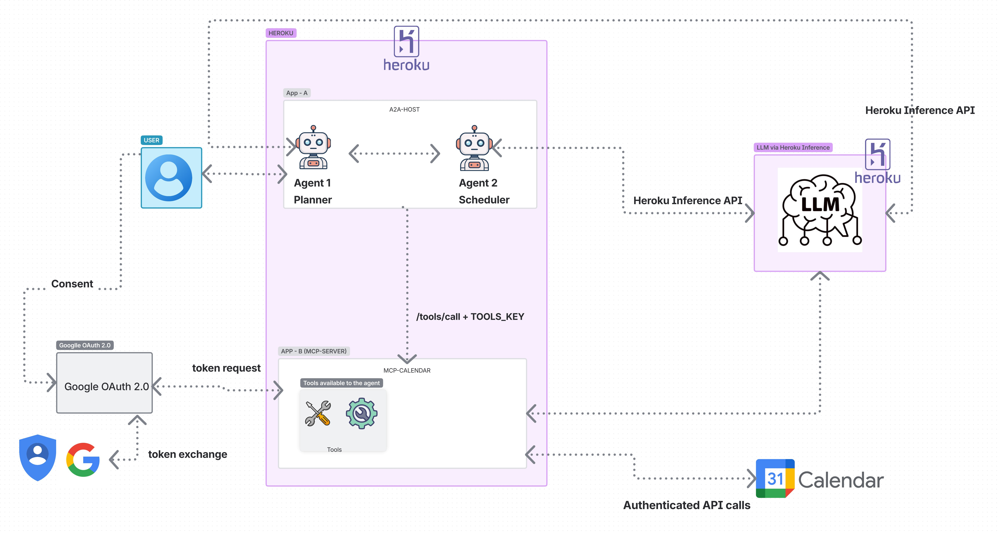

# Talking to Your Calendar: An Agent-to-Agent Calendar Booking System

An intelligent calendar booking system that uses two specialized AI agents to process natural language meeting requests, check availability, and book meetings automatically.

## Architecture

This project consists of two main services:

1. **a2a-host**: Handles agent-to-agent communication
   - Planner Agent: Processes natural language requests
   - Scheduler Agent: Makes calendar operation decisions
   - API endpoints for user interaction

2. **mcp-calendar**: Provides calendar tools and integration
   - Tools API with standardized endpoints
   - Google Calendar integration
   - Free/busy checking



## Features

- Natural language understanding for meeting requests
- Automatic extraction of meeting details (title, time, attendees)
- Calendar availability checking
- Google Meet link generation
- Secure authentication between services
- OAuth integration with Google Calendar
- Heroku Inference API for flexible model selection

## Technologies Used

- Python with FastAPI
- Heroku for deployment
- Heroku Inference API for LLM access
- Google Calendar API
- JWT for secure tokens
- Pydantic for data validation

## Setup Instructions

### Prerequisites

- Heroku account
- Google Cloud Platform account with Calendar API enabled
- Python 3.9+

### Environment Variables

#### a2a-host Service:
- `MCP_CAL_URL`: URL of the mcp-calendar service
- `TOOLS_KEY`: Shared secret for service-to-service authentication
- `INFERENCE_KEY`: Heroku Inference API key
- `INFERENCE_URL`: Heroku Inference API URL
- `INFERENCE_MODEL`: LLM model to use

#### mcp-calendar Service:
- `TOOLS_KEY`: Same shared secret as a2a-host
- `GOOGLE_CLIENT_ID`: OAuth client ID from Google Cloud Console
- `GOOGLE_CLIENT_SECRET`: OAuth client secret
- `OAUTH_REDIRECT_URI`: Redirect URI for OAuth flow
- `GOOGLE_REFRESH_TOKEN`: Refresh token obtained from OAuth flow

### Deployment

1. Deploy both services to Heroku:
   ```
   # For a2a-host
   cd a2a-host
   heroku create a2a-host
   git push heroku main
   
   # For mcp-calendar
   cd ../mcp-calendar
   heroku create mcp-calendar
   git push heroku main
   ```

2. Set up the environment variables in Heroku:
   ```
   heroku config:set MCP_CAL_URL=https://mcp-calendar.herokuapp.com -a a2a-host
   heroku config:set TOOLS_KEY=your_secret_key -a a2a-host
   # Set other environment variables similarly
   ```

3. Complete the OAuth flow by visiting the `/oauth/start` endpoint:
   ```
   https://mcp-calendar.herokuapp.com/oauth/start
   ```

4. Copy the refresh token from the callback page and set it in Heroku:
   ```
   heroku config:set GOOGLE_REFRESH_TOKEN=your_refresh_token -a mcp-calendar
   ```

5. Test the system with a natural language meeting request:
   ```
   curl -X POST https://a2a-host.herokuapp.com/a2a/plan \
     -H "Content-Type: application/json" \
     -d '{"prompt": "Book a meeting with John tomorrow at 3pm"}'
   ```

## API Endpoints

### a2a-host Service:
- `POST /a2a/plan`: Plan a meeting from natural language
- `POST /a2a/confirm`: Confirm and book a planned meeting
- `POST /a2a/dry-run`: Test planning without booking

### mcp-calendar Service:
- `GET /tools/list`: List available calendar tools
- `POST /tools/call`: Execute calendar operations
- `GET /oauth/start`: Start OAuth flow
- `GET /oauth/callback`: OAuth callback endpoint

## Model Control Protocol (MCP)

The Model Control Protocol is a standardized way for AI models to interact with external tools and services. In this project, the mcp-calendar service implements this concept by:

1. Providing a standardized tools API
2. Describing available tools and their schemas
3. Executing tool calls and returning results in a consistent format

This approach makes it easy to add new tools or integrate with different services without changing the core application logic.

## Agent-to-Agent Communication

The system uses two specialized AI agents:

1. **Planner Agent**: Extracts structured meeting details from natural language requests
2. **Scheduler Agent**: Makes decisions about calendar operations based on the structured data

This separation of concerns allows each agent to focus on its specific task, making the system more modular and maintainable.

## License

[MIT License](LICENSE)

## Author

Rhea DSouza
